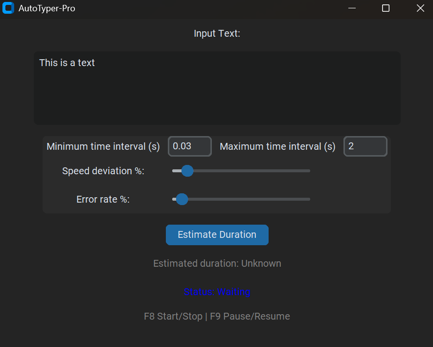

# AutoTyper Pro – Human Typing Simulation Tool

AutoTyper Pro is a realistic, customizable typing simulator built with Python and CustomTkinter. It mimics human typing behavior with variable speed, typo simulation, corrections, fatigue pauses, and more.


## 🚀 Features:

- **Simulates human typing rhythm:**

    - Faster for letters, slower for punctuation

    - First-letter delay (buffer)

    - Typo insertion & correction (with word deletion)

    - Fatigue pauses after typing for a while

    - Faster repeated characters

- **GUI with real-time customization:**

    - Min/max delay (typing speed range)

    - Typing speed bias slider

    - Typo rate control (0–100%)

    - Typing time estimation

    - Global hotkey support (default F8/F9)

    - Always-on-top interface

    - Packaged as standalone .exe (no Python needed)

## 📷 Screenshot:


## 💻 How to Use

**Option 1 – Use the Windows .exe**
1. Download AutoTyper.exe from the Releases section
2. Double-click to run

**Option 2 – Run from Python:**
```bash
    pip install -r requirements.txt
    python Autotyper.py
```

---

## 📄 License
MIT License – Free to use, modify and share with attribution.

---

## 🙏 Support
Star this repo to support the project ⭐
Feel free to open issues or suggestions.